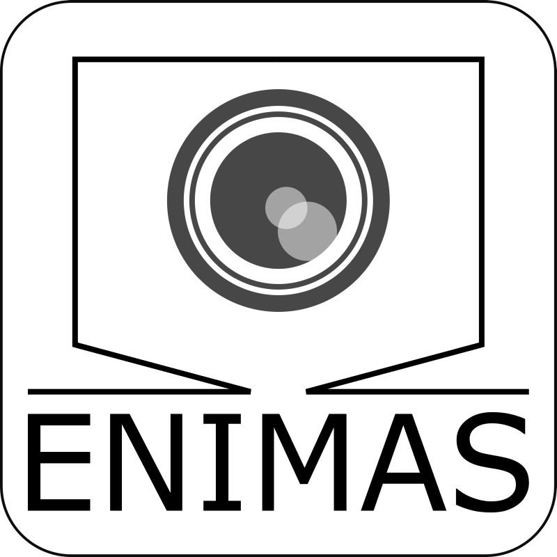
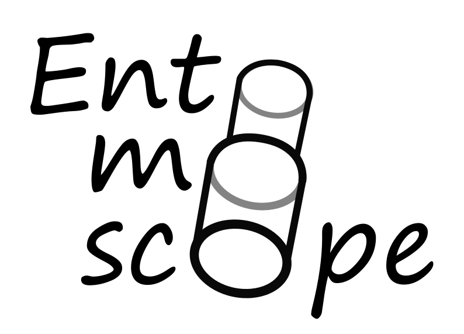

# ENIMAS 2.0: Entomoscope IMAging Software

<p align="center">
  
</p>

<p align="center">
  <a href="https://www.python.org/downloads/release/python-31011/"></a>
  <a href="LICENSE"></a>
  <a href="LICENSE-CERN-OHL-P-2.0"></a>
  
  
  <a href="https://doi.org/10.64898/2026.01.23.701290"></a>
</p>

**ENIMAS 2.0** is an open-source, AI-integrated software platform designed for the rapid digitization of insect specimens. Developed as the software core of the **Entomoscope 2.0** hardware platform, it automates the entire imaging workflow—from focus stacking and image acquisition to AI-driven cropping, background removal, and morphometric analysis.

> **Paper:** *Entomoscope 2.0 and ENIMAS 2.0: An Open-Source, AI-Integrated Platform for Rapid and Affordable Insect Digitization*  
> **Authors:** Hossein Shirali, Nick Eric Böse, Markus Kramer, Jiahui Wang, Nathalie Klug, Ralf Mikut, Rudolf Meier, Christian Pylatiuk, Lorenz Wührl  
> **DOI:** [https://doi.org/10.64898/2026.01.23.701290](https://doi.org/10.64898/2026.01.23.701290)

---

## 🚀 Key Features

| Feature | Description |
|---------|-------------|
| 🤖 **End-to-End Automation** | Seamless workflow from raw image capture to curated, publication-ready dataset |
| 📏 **Automated Morphometrics** | Uses **YOLOv8-OBB** to detect and measure specimen length/width with Human-in-the-Loop (HITL) interface |
| ✂️ **Smart Cropping** | YOLO-based rapid cropping for high-throughput batch processing |
| 🎨 **Background Removal** | BoxSegmenter-based high-fidelity semantic segmentation for precise background removal |
| 🧠 **AI Classification** | Integrated ONNX runtime for rapid taxonomic screening using custom or pre-trained models |
| 📸 **Focus Stacking** | Built-in open-source stacking algorithm + optional Helicon Focus integration |
| 🔌 **Plugin Architecture** | Modular system to extend functionality without altering core code |
| ☁️ **Zenodo Integration** | One-click upload to archive datasets with persistent DOIs for FAIR data compliance |

---

## 🛠️ Hardware Requirements

ENIMAS 2.0 is designed to control the **Entomoscope 2.0** hardware platform.

| Component | Supported Hardware |
|-----------|-------------------|
| **Camera** | ArduCam (IMX477) USB 3.0, VAImaging (MER2-1220-32U3C) USB 3.0 |
| **Stage** | Custom linear stage with Arduino-controlled servo motor |
| **Compute** | Windows 10/11 PC (Intel Core i7 recommended; GPU optional for faster inference) |

🔗 **Hardware Design Files:** Complete CAD models, STLs, and Bill of Materials (BOM) for building the Entomoscope 2.0 are included in this repository under [`UserInterface/Partslist/`](UserInterface/Partslist).


---

## 📥 Installation

### One-Click Installation (Recommended)

We provide a fully automated installation script for Windows 10/11. The easiest way to get started:

1. **Download `install.bat`** directly from the stable branch:
   [Download install.bat](https://gitlab.kit.edu/kit/iai/ber/enimas2/-/raw/main/install.bat?inline=false)
   *(If the file opens as text in your browser, click the **Download** icon in the top-right corner to save it)*
2. Run `install.bat`. A fresh installation or explicit repair requests
   administrator rights. A complete legacy 1.0.7-1.2.x installation also requests one UAC
   approval to create the protected updater and remove the old broad folder
   permission; later healthy application-only updates run without UAC. Older,
   incomplete, or inconsistent installations are offered data-preserving Repair.
3. Follow the on-screen prompts. The installer downloads an immutable release and validates it before activation.
4. **Restart your computer** after installation completes

The current installer prints an `ENIMAS installer revision` and the official
download URL when it starts. If no revision is shown, download `install.bat`
again from the link above before running Repair. If Repair fails, keep the
original window open and send the displayed failed step, revision, and log path
to ENIMAS support; the failure screen does not indicate that user data was
removed.

> ⏱️ **Installation time:** Approximately 20-30 minutes (depending on internet speed)

Alternatively, if you prefer to have the full repository locally first:

- **Option A:** [Download ZIP](https://gitlab.kit.edu/kit/iai/ber/enimas2/-/archive/main/enimas2-main.zip), extract, then run `install.bat`
- **Option B:** Clone via Git, then run `install.bat`:
  ```bash
  git clone -b main https://gitlab.kit.edu/kit/iai/ber/enimas2.git
  ```

#### What the installer does:

- Installs Python 3.10.11 when the compatible system runtime is absent
- ✅ Creates an isolated virtual environment
- ✅ Installs PyTorch (CPU version) and all dependencies
- ✅ Installs Visual C++ Redistributables
- ✅ Installs camera drivers (ArduCam & VAImaging)
- ✅ Creates Desktop and Start Menu shortcuts

> **Runtime note:** Python 3.10 compatibility is retained for the first
> incremental-updater release so that camera and vendor SDK behavior does not
> change at the same time. Python 3.10 reaches end of life in October 2026, so
> migration to Python 3.12 is a separate required validation and release step.


---

## 🎮 Usage

### Launching ENIMAS

After installation, launch the application using one of these methods:

1. **Desktop Shortcut:** Double-click the `ENIMAS2.0` icon on your desktop
2. **Start Menu:** Search for "ENIMAS2.0" in the Start Menu
3. **Command Line:** Run `ENIMAS.bat` from the installation directory

### Basic Workflow


1. **Connect Hardware:** Connect camera and motor controller
2. **Set Focus Points:** Define top and bottom focus positions
3. **Capture Stack:** Take automated focus stack images
4. **AI Processing:** Automatic stacking, cropping, measurement, and classification
5. **Export:** Save images and metadata, optionally upload to Zenodo

### Batch Processing (Plugins)

Process existing image datasets without connected hardware:

1. Navigate to the **Plugins** section in the sidebar
2. Select a plugin:
   - **Cropping:** Automatically detect and crop specimens
   - **Measurement:** Extract morphometric data (length, width)
   - **Classification:** Run AI species classification
   - **Uniform Background:** Remove and standardize backgrounds
3. Select input folder and configure options
4. Click **Start** to process

---

## 🧩 Plugin System

ENIMAS 2.0 features a modular plugin architecture for easy extension:

| Plugin | Description | Output |
|--------|-------------|--------|
| **Cropping** | Detects specimens using YOLO and crops to bounding box | Cropped images |
| **Measurement** | Uses YOLOv8-OBB to measure specimen dimensions | Excel file with measurements |
| **Classification** | Runs ONNX classification models on images | Excel file with predictions |
| **Uniform Background** | Removes background using BoxSegmenter | Images with uniform background |

### Creating Custom Plugins

Plugins inherit from `PluginBase` and can be added to the `plugins/` directory. See existing plugins for reference.

---

## 🤖 AI Models

### Pre-Trained Models Included

| Model | Type | File | Description |
|-------|------|------|-------------|
| Insect Cropping | YOLOv8 Detection | `models/cropping/insect_crop.onnx` | General insect detection |
| OBB Measurement | YOLOv8-OBB | `models/obb/yolov8m_obb3_best.onnx` | Oriented bounding box for measurements |
| Agrilus Classifier | YOLOv8m Classification | `models/classification/Agrilus_M/` | Demo classifier for Agrilus beetles |

### Training Custom Models

Want to train your own classification model? 

📖 See **[CLASSIFICATION_MODEL_GUIDE.pdf](CLASSIFICATION_MODEL_GUIDE.pdf)** for:
- Dataset preparation guidelines
- Training with Ultralytics YOLOv8/YOLO11
- Converting models to ONNX format
- Integrating models into ENIMAS

---

## 📚 Documentation

| Document | Description |
|----------|-------------|
| [User_Guide.pdf](User_Guide.pdf) | Complete user manual with step-by-step instructions |
| [CLASSIFICATION_MODEL_GUIDE.pdf](CLASSIFICATION_MODEL_GUIDE.pdf) | Guide for training and deploying custom AI models |

---

## 🔧 Configuration

### Lens Calibration

Lens configurations are stored in `lenses.json`. Each lens profile includes:
- Focus height calibration for each camera type
- Scale factors (mm/pixel) for accurate measurements
- Camera-specific exposure settings

### Camera Settings

Camera parameters can be adjusted in the GUI under **Camera Settings**:
- Exposure time
- Gain
- White balance

---

## 🐛 Troubleshooting

| Issue | Solution |
|-------|----------|
| Camera not detected | Ensure drivers are installed; try unplugging and reconnecting |
| Application won't start | Check `enimas-output.log` for error details |
| Motor not responding | Verify COM port in settings; check USB connection |
| Out of memory during stacking | Reduce number of stack images or image resolution |

For additional support, check the log files:
- `enimas-output.log` - Application output and errors
- `debug.log` - Detailed debug information


---

## 📜 License

The ENIMAS software source code is licensed under the **MIT License**; see
[LICENSE](LICENSE).

The CAD, STL, Bill of Materials (BOM), and all other hardware design files in
this repository, including [`UserInterface/Partslist/`](UserInterface/Partslist) and
[`3D_printed_parts/`](3D_printed_parts),
are licensed under the **CERN Open Hardware Licence Version 2 - Permissive
(CERN-OHL-P-2.0)**; see [LICENSE-CERN-OHL-P-2.0](LICENSE-CERN-OHL-P-2.0).

---

## 👥 Authors & Acknowledgments

**Developed at:**  
[Karlsruhe Institute of Technology (KIT)](https://www.kit.edu/) - Institute for Automation and Applied Informatics (IAI)

**Core Team:**
- Hossein Shirali
- Nick Eric Böse
- Markus Kramer
- Jiahui Wang
- Nathalie Klug
- Rudolf Meier
- Christian Pylatiuk
- Lorenz Wührl


---

<p align="center">
  
  <br/>
  <sub>Built with ❤️ for the entomology community</sub>
</p>
